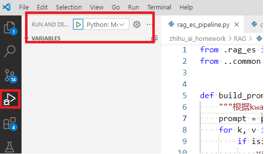

# README

- 本项目是知乎 AI 全栈工程师培训班的课堂练习和作业

# 如何跑例子

- 由于想把每节课的内容分开组织到不同文件夹，需要使用`python -m`执行例子, 为了能正确执行 python module, 配置了 launch.json, 执行例子，需要使用左侧栏 Run and Debug(Ctrl+Shift+D)->run 执行 python module
- 

# 相关文档

- 参考: [这里](https://f7dmbpckkt.feishu.cn/wiki/Y93Iw7ljfibZmlkRdoDcZ8oEnPb)
